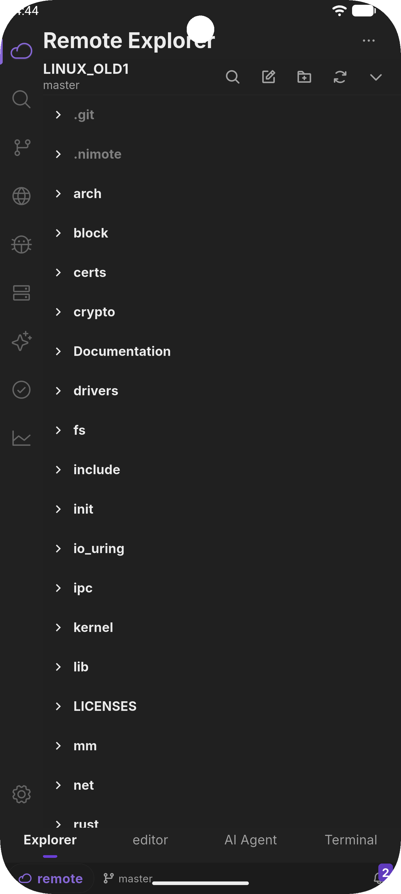
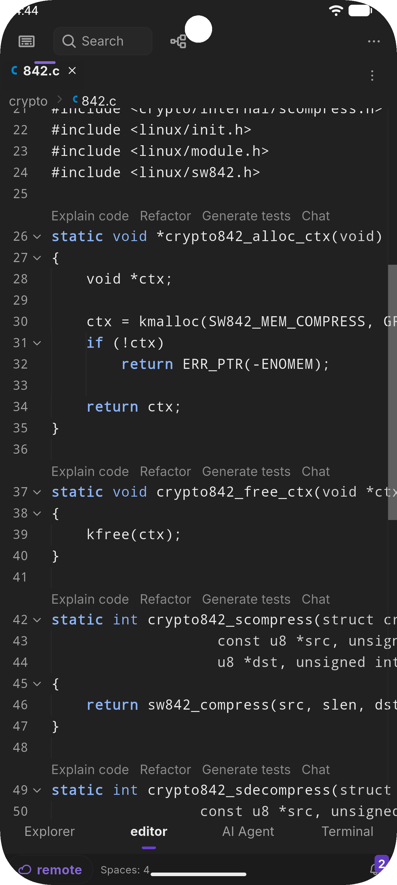
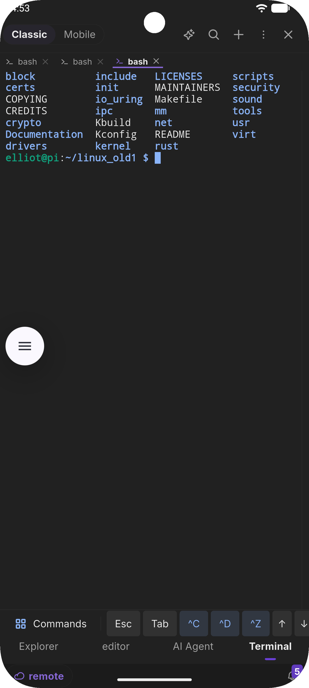
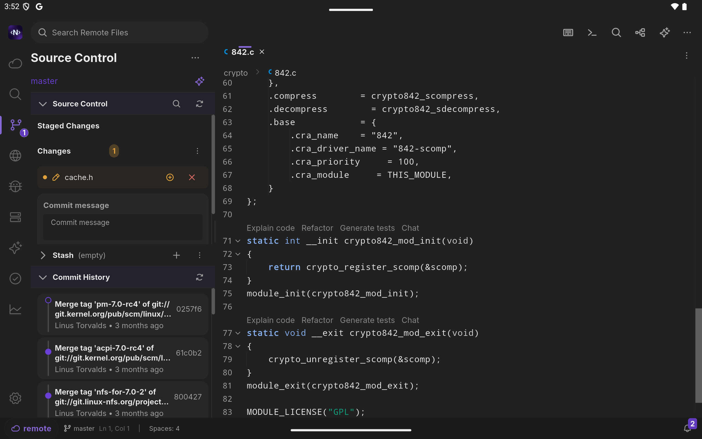
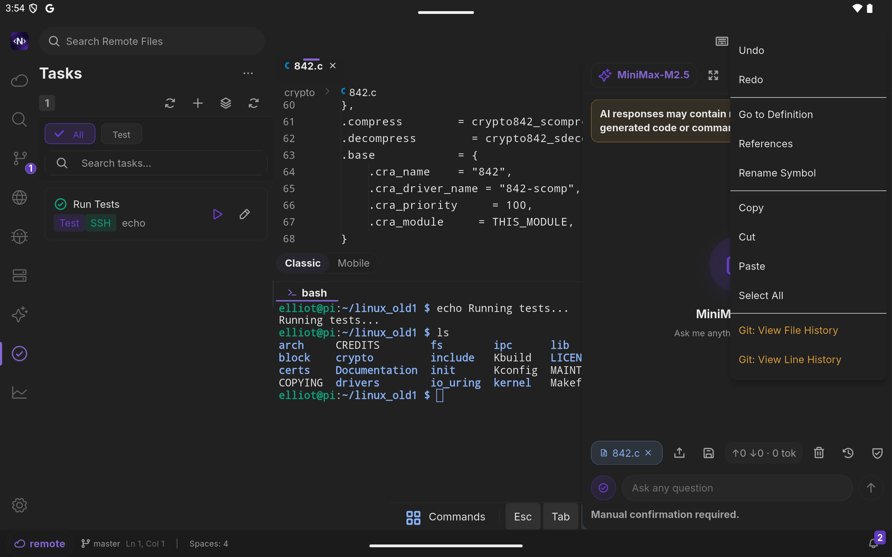

# NimoteCode

  

<h3 align="center">Code anywhere. Ship everywhere.</h3>

  A professional mobile IDE for local and SSH workspaces, built for real development work on iPhone, iPad, and Android.

  <strong>Supports iOS and Android</strong> · App Store and Google Play release in progress

  <a href="https://nimotecode.com"><strong>Official Website</strong></a>
  ·
  <a href="https://nimotecode.com/download"><strong>Download</strong></a>
  ·
  <a href="https://nimotecode.com/docs/quick-start"><strong>Quick Start</strong></a>
  ·
  <a href="https://x.com/nimotecode"><strong>X</strong></a>
  ·
  <a href="https://github.com/nimotecode/nimote_issues/issues"><strong>Issues</strong></a>

---
## Keywords

mobile IDE, ssh client, remote development, code editor, iOS app, Android app, flutter app, rust backend, developer tools

## Why NimoteCode

NimoteCode turns your phone or tablet into a practical coding workspace. Connect to servers over SSH, edit files, run commands, review Git changes, use AI assistance, debug issues, and ship fixes without reaching for a laptop.

It is designed for developers who need to respond quickly, maintain remote systems, prototype ideas, or keep working while away from their desk.

## Preview

### Mobile Workflow

  
  
  

### iPad Workspace

  
  

<!--
Demo video can be added here later.
Recommended format:

  

-->

## Core Features

| Area | What you can do |
| --- | --- |
| **SSH Workspaces** | Connect to remote servers, browse files, edit code, and recover from network interruptions with heartbeat monitoring and auto-reconnection. |
| **Code Editor** | Work with syntax highlighting, outline navigation, find/replace, symbol search, and multi-file editing. |
| **Terminal** | Run commands in persistent terminal sessions, search terminal output, and save frequent commands for faster workflows. |
| **Source Control** | Review diffs, stage changes, commit, branch, stash, sync, and generate Git assistance with AI. |
| **AI Chat & Agent** | Ask questions, explain code, refactor files, automate repetitive tasks, and keep workspace-aware memory. |
| **LSP & Debug** | Use diagnostics, code actions, breakpoints, call stacks, variables, watches, and debug console workflows. |
| **Tasks & Timeline** | Run repeatable tasks, capture development events, trace issues, and use AI-assisted root-cause analysis. |
| **Sync / Cache** | Sync project files between local and remote workspaces with safer path handling and operation history. |

## Built For

- Emergency production fixes when your laptop is not nearby
- Remote server maintenance from phone or tablet
- On-call issue triage with logs, terminal, Git, and timeline context
- Quick prototypes and learning sessions during spare time
- Developers who want an AI-assisted coding environment that can also execute actions

## Free And Pro

NimoteCode is free to start and includes the essentials for mobile development: SSH workspace, editor, terminal, AI Chat, Timeline, Tasks, search, themes, keyboard settings, and account features.

Pro unlocks advanced professional workflows including Source Control, Git AI, LSP, Debug, multi-terminal support, file and line history, and Sync / Cache.

| Feature | Free | Pro |
| --- | :---: | :---: |
| SSH workspace and auto-reconnection | Yes | Yes |
| Editor, terminal, search, and tasks | Yes | Yes |
| AI Chat and Timeline analysis | Yes | Yes |
| Source Control and Git AI |  | Yes |
| LSP diagnostics and code actions |  | Yes |
| Debugger |  | Yes |
| Multi-terminal support |  | Yes |
| Local / remote sync |  | Yes |

## Download

NimoteCode supports both **iOS** and **Android**. The app is currently being published to the App Store and Google Play.

| Platform | Status |
| --- | --- |
| **iOS** | App Store listing in progress |
| **Android** | Google Play listing in progress |

Download links will be added here when the store pages are live.

- **Website:** https://nimotecode.com/download

## Documentation

- [Introduction](https://nimotecode.com/introduction)
- [Quick Start](https://nimotecode.com/docs/quick-start)
- [SSH Workspace](https://nimotecode.com/docs/ssh)
- [AI](https://nimotecode.com/docs/ai)
- [Source Control](https://nimotecode.com/docs/source-control)
- [Debug](https://nimotecode.com/docs/debug)

## Support

- Email: aoun.ma@foxmail.com
- X: https://x.com/nimotecode
- Issues: https://github.com/nimotecode/nimote_issues/issues
